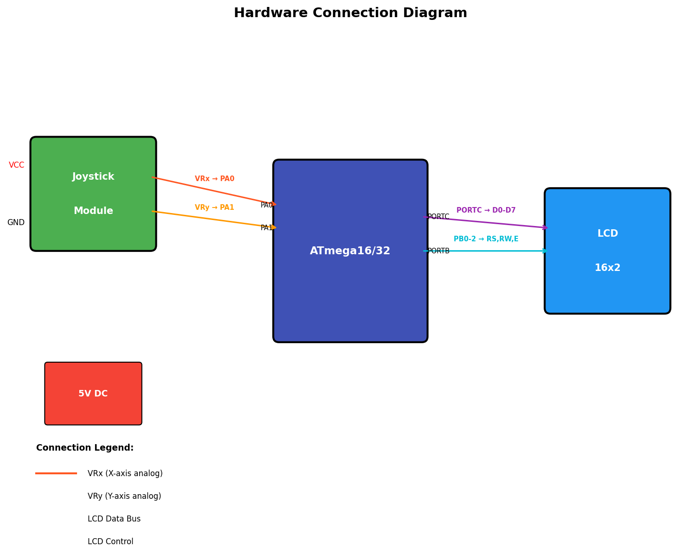
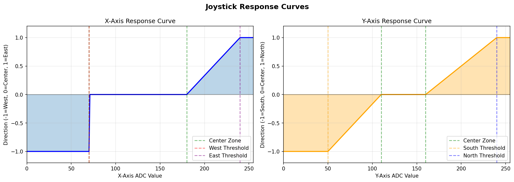

# AVR Joystick Interface Library

[](LICENSE)
[](https://www.microchip.com/en-us/products/microcontrollers-and-microprocessors/8-bit-mcus/avr-mcus)
[](https://www.microchip.com/en-us/product/ATmega16)
[](#testing)

A professional, modular library for interfacing analog joysticks with AVR ATmega16/ATmega32 microcontrollers. Features comprehensive direction detection, LCD display support, and extensive testing.


---

## Features

- **8-Direction Detection** - Accurately detects N, S, E, W, NE, NW, SE, SW, and Center positions
- **Dead Zone Support** - Configurable center dead zone prevents jitter when joystick is at rest
- **Modular Architecture** - Separate ADC, LCD, and Joystick modules for easy reuse
- **LCD Display** - Built-in 16x2 LCD driver for position/direction display
- **Comprehensive Testing** - 48 unit tests covering all direction detection scenarios
- **Visual Documentation** - Include diagrams showing detection zones and response curves

---

## Table of Contents

- [Hardware Requirements](#hardware-requirements)
- [Installation](#installation)
- [Quick Start](#quick-start)
- [Examples](#examples)
- [Direction Detection](#direction-detection)
- [API Reference](#api-reference)
- [Testing](#testing)
- [Visualization](#visualization)
- [Contributing](#contributing)
- [License](#license)

---

## Hardware Requirements

### Components

| Component | Quantity | Description |
|-----------|----------|-------------|
| ATmega16/ATmega32 | 1 | Main microcontroller |
| Analog Joystick Module | 1 | 2-axis joystick with potentiometers |
| 16x2 LCD Display | 1 | HD44780-compatible (optional) |
| 10kΩ Potentiometer | 1 | LCD contrast adjustment |
| 5V Power Supply | 1 | USB or regulated power |

### Pin Connections



#### Joystick Connections

| Joystick Pin | MCU Pin | Description |
|--------------|---------|-------------|
| VRx | PA0 (ADC0) | X-axis analog output |
| VRy | PA1 (ADC1) | Y-axis analog output |
| VCC | 5V | Power supply |
| GND | GND | Ground |
| SW | (optional) | Button output |

#### LCD Connections (8-bit mode)

| LCD Pin | MCU Pin | Description |
|---------|---------|-------------|
| RS | PB0 | Register Select |
| RW | PB1 | Read/Write |
| E | PB2 | Enable |
| D0-D7 | PC0-PC7 | Data bus |
| VCC | 5V | Power |
| GND | GND | Ground |
| VO | Potentiometer | Contrast |

---

## Installation

### Prerequisites

- [AVR-GCC](https://www.microchip.com/en-us/tools-resources/develop/microchip-studio) toolchain
- [AVRDUDE](https://github.com/avrdudes/avrdude) for programming
- Python 3.7+ (for testing and visualization)

### Clone the Repository

```bash
git clone https://github.com/ashishrai12/AVR-ATmega16-Joystick.git
cd AVR-ATmega16-Joystick
```

### Install Python Dependencies (for testing)

```bash
pip install -r requirements.txt
```

---

## Quick Start

### 1. Configure Your Hardware

Edit `include/config.h` to match your setup:

```c
#define F_CPU 16000000UL      // Your CPU frequency
#define JOYSTICK_X_CHANNEL 0  // X-axis ADC channel
#define JOYSTICK_Y_CHANNEL 1  // Y-axis ADC channel
```

### 2. Build an Example

```bash
make direction_display
```

### 3. Flash to MCU

```bash
make flash-direction_display
```

### 4. Basic Code Example

```c
#include "config.h"
#include "joystick.h"
#include "lcd.h"

int main(void) {
    joystick_position_t pos;
    joystick_direction_t dir;
    
    joystick_init();
    lcd_init();
    
    while (1) {
        joystick_read(&pos);
        dir = joystick_get_direction(pos.x, pos.y);
        
        lcd_set_cursor(0, 0);
        lcd_print("Dir: ");
        lcd_print(joystick_direction_to_string(dir));
        
        _delay_ms(100);
    }
}
```

---

## Project Structure

```
AVR-ATmega16-Joystick/
├── include/                    # Header files
│   ├── config.h               # Hardware configuration
│   ├── adc.h                  # ADC driver interface
│   ├── lcd.h                  # LCD driver interface
│   └── joystick.h             # Joystick interface
├── src/                        # Source implementations
│   ├── adc.c                  # ADC driver
│   ├── lcd.c                  # LCD driver
│   └── joystick.c             # Joystick logic
├── examples/                   # Example applications
│   ├── digital_input/         # Digital GPIO reading
│   ├── adc_reading/           # Basic ADC reading
│   ├── direction_display/     # Direction on LCD
│   └── xy_display/            # X/Y coordinates on LCD
├── tests/                      # Python test suite
│   ├── conftest.py            # Pytest configuration
│   ├── joystick_logic.py      # Python joystick logic
│   ├── test_joystick_logic.py # Direction tests (28 tests)
│   └── test_adc_simulation.py # ADC tests (20 tests)
├── visualization/              # Visualization tools
│   ├── direction_zones.py     # Zone diagram generator
│   └── joystick_visualizer.py # Interactive visualizer
├── docs/                       # Documentation
│   ├── API.md                 # API reference
│   └── images/                # Generated diagrams
├── Makefile                    # Build system
├── requirements.txt            # Python dependencies
└── README.md                   # This file
```

---

## Examples

### 1. Digital Input (`examples/digital_input/`)

Basic GPIO-based joystick reading (no ADC required).

```bash
make digital_input
make flash-digital_input
```

### 2. ADC Reading (`examples/adc_reading/`)

Read raw X/Y values via ADC and center them around 0.

```bash
make adc_reading
```

### 3. Direction Display (`examples/direction_display/`)

Display detected direction (N, S, E, W, etc.) on LCD.

```bash
make direction_display
make flash-direction_display
```

### 4. XY Display (`examples/xy_display/`)

Display raw X and Y coordinate values on LCD.

```bash
make xy_display
```

---

## Direction Detection

The library uses threshold-based zone detection to determine joystick direction from ADC readings.

### Detection Zones



### Zone Boundaries

| Direction | X Range | Y Range |
|-----------|---------|---------|
| **Center** | 70-180 | 110-160 |
| **North** | 70-180 | ≥240 |
| **South** | 70-180 | ≤50 |
| **East** | ≥240 | 110-180 |
| **West** | ≤70 | 110-180 |
| **North-East** | >230 | >230 |
| **North-West** | <50 | >205 |
| **South-East** | >230 | <50 |
| **South-West** | <50 | <50 |

### How It Works

The analog joystick contains two potentiometers that output variable voltages (0-5V) based on position. The ATmega's ADC converts these to digital values:

1. **At Rest**: Both axes read ~128 (center position)
2. **Pushed Up (North)**: Y-axis reads high (~240-255)
3. **Pushed Right (East)**: X-axis reads high (~240-255)
4. **Corners**: Both axes at extremes simultaneously

The `joystick_get_direction()` function analyzes these values using configurable thresholds defined in `config.h`.

---

## API Reference

For complete API documentation, see [docs/API.md](docs/API.md).

### Quick Reference

#### ADC Module

```c
void adc_init(void);                    // Initialize ADC
uint16_t adc_read(uint8_t channel);     // 10-bit read
uint8_t adc_read_8bit(uint8_t channel); // 8-bit read
```

#### LCD Module

```c
void lcd_init(void);                      // Initialize LCD
void lcd_print(const char *str);          // Print string
void lcd_print_int(int16_t value);        // Print integer
void lcd_set_cursor(uint8_t row, uint8_t col);  // Move cursor
void lcd_clear(void);                     // Clear display
```

#### Joystick Module

```c
void joystick_init(void);                 // Initialize joystick
void joystick_read(joystick_position_t *pos);  // Read position
joystick_direction_t joystick_get_direction(uint8_t x, uint8_t y);  // Get direction
const char* joystick_direction_to_string(joystick_direction_t dir); // Direction name
uint8_t joystick_is_centered(uint8_t x, uint8_t y);  // Check center
```

---

## Testing

The project includes a comprehensive Python test suite that validates the direction detection algorithm without requiring hardware.

### Run Tests

```bash
# Install dependencies
pip install -r requirements.txt

# Run all tests
python -m pytest tests/ -v

# Run with coverage
python -m pytest tests/ -v --cov=tests
```

### Test Results

```
============================= test session starts =============================
collected 48 items

tests/test_adc_simulation.py ........................            [ 41%]
tests/test_joystick_logic.py ............................        [100%]

============================= 48 passed in 0.33s ==============================
```

### Test Categories

| Category | Tests | Description |
|----------|-------|-------------|
| Center Detection | 5 | Dead zone validation |
| Cardinal Directions | 4 | N, S, E, W detection |
| Diagonal Directions | 4 | NE, NW, SE, SW detection |
| Boundary Conditions | 5 | Threshold edge cases |
| Direction Strings | 3 | String conversion |
| Position Info | 2 | Complete position data |
| ADC Simulation | 5 | Axis sweep tests |
| Noise Handling | 2 | Jitter and stability |
| ADC Conversion | 20 | Value mapping and filtering |

---

## Visualization

Generate visual documentation with the included Python scripts.

### Generate All Diagrams

```bash
python visualization/direction_zones.py
```

This creates:
- `docs/images/direction_zones.png` - Color-coded detection zones
- `docs/images/joystick_response.png` - Response curves for X/Y axes
- `docs/images/hardware_diagram.png` - Hardware connection diagram

### Interactive Visualizer

Launch an interactive tool to explore direction detection:

```bash
python visualization/joystick_visualizer.py
```

Use the sliders to simulate joystick movement and see real-time direction detection.

---

## Building

### Available Make Targets

```bash
make                  # Build library
make help             # Show all targets
make <example>        # Build specific example
make examples         # Build all examples
make flash-<example>  # Flash example to MCU
make size-<example>   # Show memory usage
make clean            # Remove build files
```

### Configure MCU

Edit the Makefile to change target MCU:

```makefile
MCU = atmega16        # or atmega32
F_CPU = 16000000UL    # CPU frequency
PROGRAMMER = usbasp   # Programmer type
```

---

## Contributing

Contributions are welcome! Please follow these steps:

1. Fork the repository
2. Create a feature branch (`git checkout -b feature/amazing-feature`)
3. Make your changes
4. Run tests (`python -m pytest tests/ -v`)
5. Commit (`git commit -m 'Add amazing feature'`)
6. Push (`git push origin feature/amazing-feature`)
7. Open a Pull Request

### Code Style

- C code follows [Linux kernel style](https://www.kernel.org/doc/html/latest/process/coding-style.html)
- Python code follows [PEP 8](https://pep8.org/)
- All functions must be documented with Doxygen-style comments

---

## License

This project is licensed under the MIT License - see the [LICENSE](LICENSE) file for details.

---

## Acknowledgments

- AVR-GCC and AVRDUDE communities
- HD44780 LCD datasheet authors
- ATmega16/32 datasheet from Microchip

---


